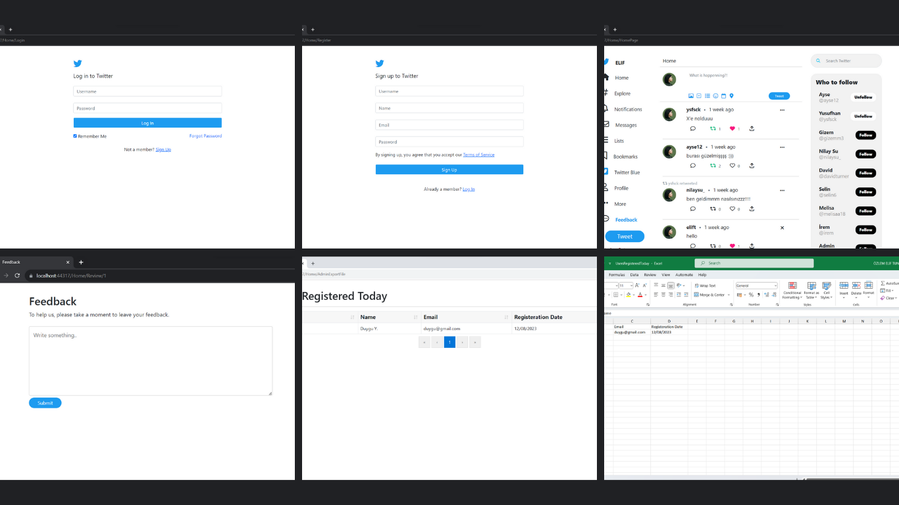

# Twitter Clone
This application is a simple Twitter clone built using ASP.NET MVC and C#. It allows users to post tweets, follow other users, and engage with content.

## Features

- Users can sign up for an account and log in securely.
- Users can post tweets, which are displayed in their timeline.
- Users can follow other users to see their tweets on their timeline.
- Users can give feedback which will be saved to Google Sheets.
- Admin can display users registered today with Grid.Mvc and export it to excel file.

## Screenshots

## Contact

If you have any questions, feedback, or would like to connect, feel free to reach out to me.

- **Name:** Elif Tuncer
- **Email:** oeliftuncer@gmail.com
- **LinkedIn:** [Elif Tuncer](https://www.linkedin.com/in/elif-tuncer/)

Feel free to contact me through any of the channels above. I'm open to collaborations and discussions related to Web programming.# TwitterClone
# TwitterClone
# TwitterClone
